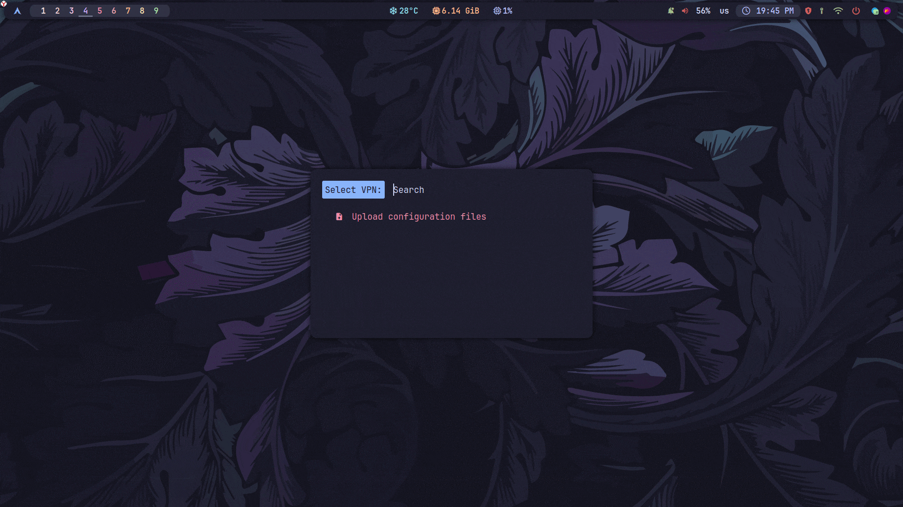

<div align="center">
  <h2>🛡 Rofi OpenVPN Manager</h2>
</div>

Improve your workflow with **rofi-openvpn**, a utility for easy management of **openvpn connections**.
An ideal tool for **Linux** enthusiasts seeking maximum
efficiency and organization of their system resources.


<div align="center">



</div>


<div align="center">
  <h2>👨‍💻 Installation</h2>
</div>

1. Cloning the repository: `git clone https://github.com/DIMFLIX-OFFICIAL/rofi-openvpn.git ~/bin/rofi-openvpn`
2. Go to the catalog: `cd ~/bin/rofi-openvpn`
3. Launching utility: `sh rofi-vpn-manager.sh`
4. (Optional) For easy access, add the script somewhere in your $PATH.


<div align="center">
  <h2>⚙️ Polybar Configuration</h2>
</div>

```
[module/rofi_vpn_manager]
type = custom/script
exec = "sh $HOME/bin/rofi-vpn-manager.sh status"
interval = 2
click-left = "sh $HOME/bin/rofi-vpn-manager.sh"
label = "%output%"
```

<div align="center">
  <h2>📜 License</h2>
</div>

This project is released under the **MIT license**, which grants the following permissions:

- Commercial use
- Distribution
- Modification
- Private use

For more convoluted language, see the [**MIT License**](LICENSE)
